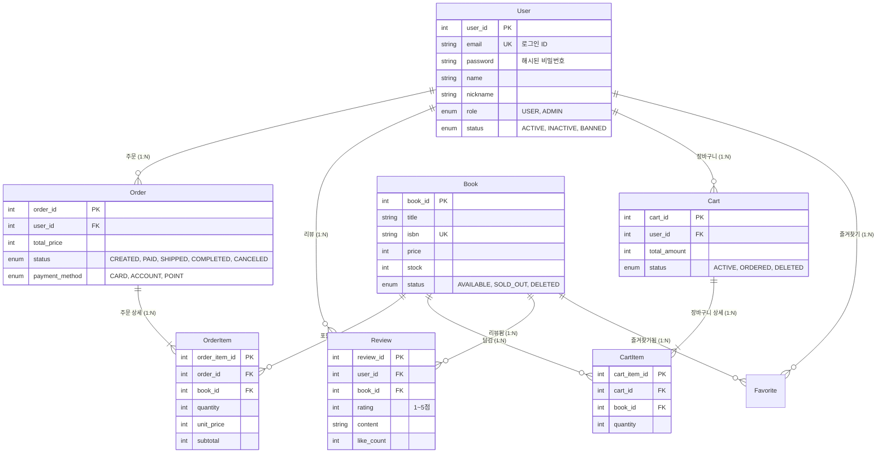

# 데이터베이스 스키마 (Database Schema)

## ER 다이어그램 (ER Diagram)

```mermaid
erDiagram
    User ||--o{ Order : "주문 (1:N)"
    User ||--o{ Review : "리뷰 (1:N)"
    User ||--o{ Cart : "장바구니 (1:N)"
    User ||--o{ Favorite : "즐겨찾기 (1:N)"
    
    Order ||--|{ OrderItem : "주문 상세 (1:N)"
    Cart ||--|{ CartItem : "장바구니 상세 (1:N)"
    
    Book ||--o{ OrderItem : "포함됨 (1:N)"
    Book ||--o{ CartItem : "담김 (1:N)"
    Book ||--o{ Review : "리뷰됨 (1:N)"
    Book ||--o{ Favorite : "즐겨찾기됨 (1:N)"

    User {
        int user_id PK
        string email UK "로그인 ID"
        string password "해시된 비밀번호"
        string name
        string nickname
        enum role "USER, ADMIN"
        enum status "ACTIVE, INACTIVE, BANNED"
    }

    Book {
        int book_id PK
        string title
        string isbn UK
        int price
        int stock
        enum status "AVAILABLE, SOLD_OUT, DELETED"
    }

    Order {
        int order_id PK
        int user_id FK
        int total_price
        enum status "CREATED, PAID, SHIPPED, COMPLETED, CANCELED"
        enum payment_method "CARD, ACCOUNT, POINT"
    }

    OrderItem {
        int order_item_id PK
        int order_id FK
        int book_id FK
        int quantity
        int unit_price
        int subtotal
    }

    Review {
        int review_id PK
        int user_id FK
        int book_id FK
        int rating "1~5점"
        string content
        int like_count
    }

    Cart {
        int cart_id PK
        int user_id FK
        int total_amount
        enum status "ACTIVE, ORDERED, DELETED"
    }

    CartItem {
        int cart_item_id PK
        int cart_id FK
        int book_id FK
        int quantity
    }
```

